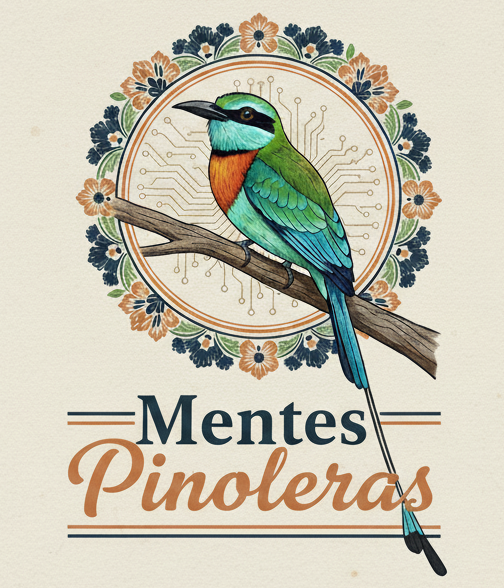

# Mentes Pinoleras
Una aplicación web innovadora y educativa, diseñada para el reto **Hackathon Disruptivo 2025**.

. 

## 📝 Descripción
Mentes Pinoleras es una plataforma dedicada a preservar, registrar y compartir los saberes populares, culturales y tradiciones de Nicaragua. Nuestra misión es involucrar activamente a la comunidad, fomentando que el patrimonio cultural llegue y sea adoptado por las nuevas generaciones.
Esta aplicación busca ser un espacio interactivo donde los usuarios puedan contribuir con sus propios "relatos" (historias, recetas, leyendas, etc.), explorar el conocimiento colectivo y participar en actividades didácticas que refuercen su identidad cultural.

## ✨ Funcionalidades Principales
* **Autenticación de Usuarios:**
    * Inicio de sesión rápido y seguro a través de Google.
    * Gestión de sesión para usuarios autenticados.
    * Funcionalidad para cerrar sesión.
* **Publicación Colaborativa de Relatos:**
    * Formulario intuitivo para que los usuarios puedan crear y compartir sus propios relatos.
    * Soporte para incluir imágenes en los relatos.
    * Feed principal que muestra todos los relatos publicados, ordenados cronológicamente.
* **Gestión de "Mis Publicaciones":**
    * Sección dedicada donde cada usuario puede ver solo los relatos que ha creado.
    * Funcionalidades de edición para modificar el título y contenido de un relato existente.
    * Funcionalidades de eliminación para borrar relatos.
* **Módulo de Retos y Juegos Didácticos:**
    * Modal interactivo para jugar a "Adivina la Palabra" (Juego #1).
    * Modal interactivo para jugar a "Trivia Cultural" (Juego #2).
    * Modal interactivo para jugar a "Juego de Mapa" (Juego #3).

## 🚀 Stack Tecnológico
Este proyecto ha sido desarrollado utilizando las siguientes tecnologías:

* **Frontend:**
    * **HTML5:** Estructura de la aplicación.
    * **CSS3:** Estilos personalizados y diseño responsive, siguiendo la paleta de colores de Mentes Pinoleras.
    * **JavaScript (ES6+):** Lógica del lado del cliente, interacción con el usuario y consumo de APIs.
* **Backend como Servicio (BaaS):**
    * **Google Firebase:**
        * **Firebase Authentication:** Para el manejo de usuarios y autenticación con Google.
        * **Cloud Firestore:** Base de datos NoSQL para almacenar relatos, usuarios, eventos, saberes y datos de juegos.
        * **Firebase Storage:** Almacenamiento de archivos multimedia (imágenes de relatos).

---
